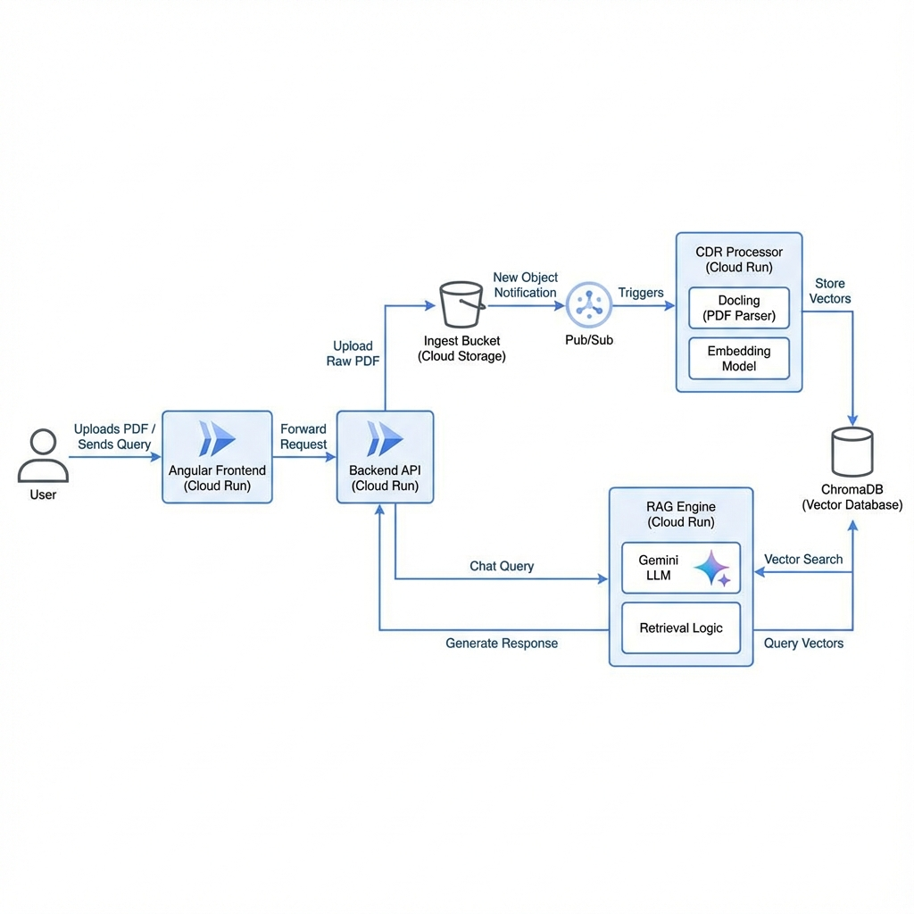

# Secure RAG & Content Disarming Demo Architecture

## Goal
Build a secure RAG application where users (simulated insurance customers) can upload documents (PDFs). The system must "disarm" these documents (CDR) before using them for RAG, ensuring no malicious active content is stored or processed by the core RAG system.

## Overview

The system acts as an insurance claims bot.
1.  **User** uploads a Car Accident Report (PDF).
2.  **System** processes the PDF:
    *   **Content Disarm**: Extracts pure text/safe formats from the PDF (using Docling). This effectively sanitizes the input by discarding the binary container and potential scripts.
    *   **Embedding**: Converts the sanitized text into vectors.
    *   **Storage**: Stores vectors in ChromaDB.
3.  **User** asks questions (e.g., "Can I get a refund?").
4.  **System** retrieves relevant context from ChromaDB and generates an answer using an LLM.

## Architecture Components

### 1. Frontend (Angular)
*   **Hosting**: Cloud Run.
*   **Features**:
    *   User Authentication (implied/mocked for demo).
    *   File Upload UI.
    *   Chat Interface for querying the RAG.
*   **Tech**: Angular, Angular Material (optional for style).

### 2. Upload/Backend Service (API Gateway pattern)
*   **Hosting**: Cloud Run.
*   **Role**:
    *   Receives file uploads.
    *   Stores raw files in **Cloud Storage (Ingest Bucket)**.
    *   Publishes "New File" event to **Pub/Sub**.
    *   Handles Chat API requests (routes to RAG Engine).

### 3. Content Disarm & Ingestion Service (Async Worker)
*   **Trigger**: Pub/Sub (triggered by Ingest Bucket upload).
*   **Hosting**: Cloud Run (Job or Service).
*   **Role**:
    *   **Disarm/Parse**: Uses **Docling** to parse the PDF and extract clean structured text/Markdown.
    *   **Sanitize**: Ensure no binary payloads survive.
    *   **Embed**: Uses `all-MiniLM-L6-v2` (via Hugging Face library or serving container) to generate embeddings.
    *   **Store**: Saves embeddings + chunks to **ChromaDB**.
    *   (Optional) Saves the "clean" text version to a **Clean Bucket** for citation.

### 4. Vector Database
*   **Tech**: ChromaDB.
*   **Hosting**: Cloud Run (Persistent Volume) or in-memory for ephemeral demo.
    *   *Design Note*: We will use a shared persistent volume or a dedicated ChromaDB service.

### 5. RAG Engine (Query Service)
*   **Hosting**: Cloud Run.
*   **Role**:
    *   Receives user query.
    *   Embeds query.
    *   Queries ChromaDB.
    *   Constructs prompt with context.
    *   Calls LLM (Gemini 1.5 Flash via Vertex AI).

## Data Flow

1.  `[User]` -> Upload PDF -> `[Frontend]` -> `[Backend API]` -> `[GCS Ingest Bucket]`
2.  `[GCS Ingest Bucket]` -> Notification -> `[Pub/Sub]`
3.  `[Pub/Sub]` -> Trigger -> `[CDR & Ingestion Service]`
4.  `[CDR & Ingestion Service]` -> Run Docling (Parse) -> Run Use `all-MiniLM-L6-v2` (Embed) -> Store in `[ChromaDB]`
5.  `[User]` -> Chat Query -> `[Frontend]` -> `[Backend API]` -> `[RAG Engine]`
    *   `[RAG Engine]` -> Search `[ChromaDB]`
    *   `[RAG Engine]` -> Generate with `[LLM]`
    *   `[RAG Engine]` -> Response -> `[User]`

## Security Highlights
*   **Untrusted Input Handling**: Raw files are isolated in the "Ingest Bucket".
*   **Disarming**: The "CDR" process destroys the original file structure and keeps only the semantic content (Text/Images), neutralizing PDF exploits.
*   **Architecture Isolation**: The RAG engine never touches the raw PDF, only the sanitized vectors/text.
