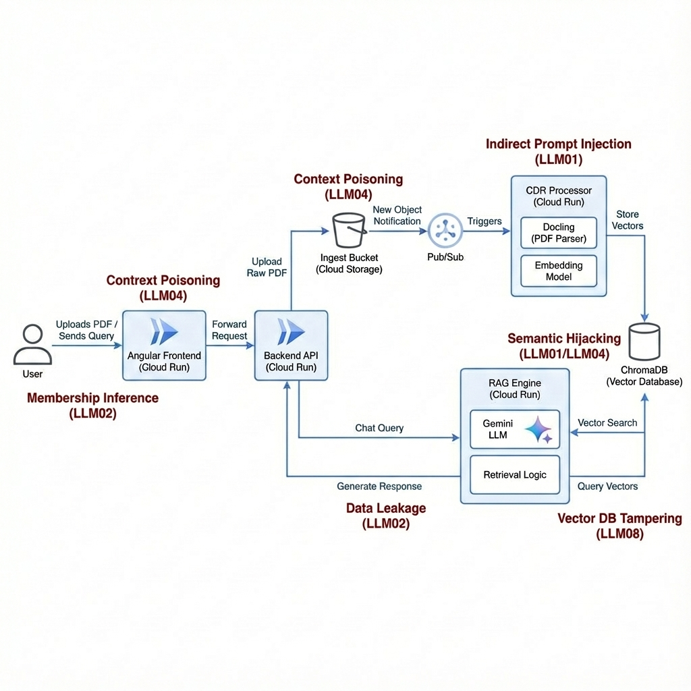

# RAG Threat Modeling for CISOs

Retrieval-Augmented Generation (RAG) shifts the goalposts for traditional threat modeling. To approach this practically on Google Cloud Platform (GCP), we move away from a generic checklist and focus on the Data Flow Diagram (DFD), specifically targeting the "retrieval" step which is often overlooked.

## 1. Decompose the GCP Architecture

Mapping out where data sits and how it moves:

*   **Data Ingestion**: Files in Cloud Storage being processed by Vertex AI Pipelines or Cloud Run.
*   **Vector Database**: Vertex AI Vector Search (formerly Matching Engine) or AlloyDB with pgvector.
*   **Orchestration**: Vertex AI SDK or LangChain running on GKE or Vertex AI Endpoints.
*   **The Model**: Gemini via the Vertex AI API.

## 2. Identify AI-Specific Threat Vectors (STRIDE + OWASP Top 10 for LLMs)

Focusing on RAG-specific risks with their OWASP LLM 2025 mappings:

### Indirect Prompt Injection (LLM01)
This is the classic RAG attack. Malicious instructions are "injected" into the context window via retrieved documents rather than the user's direct prompt.

### Context Poisoning (LLM04)
"Data and Model Poisoning" covers the integrity of the data used for RAG. Injecting a wrongful claim (e.g., insurance data) is a specific form of RAG Poisoning.

### Semantic Hijacking (LLM01 / LLM04)
This sits between Injection (the mechanism) and Poisoning (the intent). It uses the model's semantic retrieval to pull in attacker-controlled context.

### Data Leakage (LLM02)
"Sensitive Information Disclosure." This is when the RAG system retrieves and outputs data (like a PII-heavy insurance claim) to a user who shouldn't see it.

### Membership Inference (LLM02)
A sub-type of disclosure where an attacker crafts queries to see if a specific person/data point exists in the "private" RAG knowledge base.

### Vector DB Tampering (LLM08)
New for 2025: "Vector and Embedding Weaknesses." This covers unauthorized access to the vector store or exploiting the way vectors are indexed.

## 3. Practical Mitigations on GCP

*   **Identity & Access**: Use IAM Conditions to ensure only specific service accounts can query the vector index.
*   **Data Privacy**: Use the Sensitive Data Protection (DLP) API to scan and redact PII before it ever hits the vector database or the LLM.
*   **Network Security**: Wrap the architecture in a VPC Service Perimeter to prevent data exfiltration.
*   **Content Safety**: Use built-in Vertex AI Safety Filters to catch toxic or harmful outputs.
